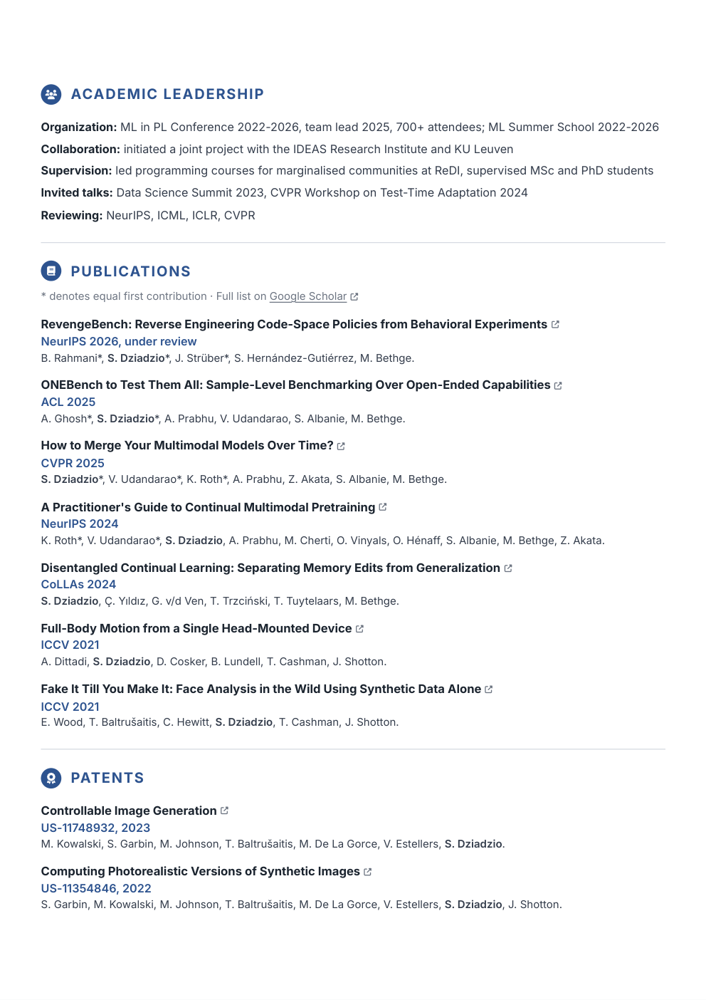

# CV

Two-page CV built from HTML + CSS and printed to PDF with headless Chrome.

<p align="center">
  <a href="https://sebastiandziadzio.com/cv/cv.pdf"></a>
  <a href="https://sebastiandziadzio.com/cv/cv.pdf"></a>
</p>

<p align="center"><em>Click either page for the <a href="https://sebastiandziadzio.com/cv/cv.pdf">PDF</a>.</em></p>

## Build

```sh
./build.sh              # cv.json + cv.css -> cv.html -> cv.pdf
./build.sh --html-only  # stop after cv.html (preview it in a browser)
./tools/screenshots.sh  # refresh the docs/*.png previews above
```

## Publish

```sh
./tools/publish.sh          # rebuild + copy into ../sebastiandziadzio.github.io
./tools/publish.sh --push   # also commit, push, and wait for it to go live
```

## Files

| File | Purpose |
| --- | --- |
| `cv.json` | All content: roles, education, publications, patents, service. **Edit this.** |
| `cv.css` | Layout and styling. Design tokens (colours, page size, margins) live in `:root`. |
| `build.mjs` | Renders `cv.json` into `cv.html`, then drives Chrome to produce `cv.pdf`. |
| `icons/` | One SVG per header/section icon, extracted from Font Awesome 6. |
| `tools/fetch-icons.sh` | Re-downloads `icons/` from the Font Awesome repo. |
| `tools/screenshots.sh` | Regenerates the `docs/` previews above from `cv.pdf`. Needs `uv`. |
| `tools/publish.sh` | Rebuilds and copies `cv.pdf` into the website repo. |
| `cv.pdf` | Generated — gitignored. Served at [sebastiandziadzio.com/cv/cv.pdf](https://sebastiandziadzio.com/cv/cv.pdf). |
| `cv.html` | Generated — self-contained, gitignored. |

## Fonts

Body text uses Inter (Inter Variable, installed locally). Chrome subsets and
embeds it into the PDF, so the output renders identically anywhere; only the
`cv.html` preview falls back on machines without Inter.

## Icons

`icons/` holds one SVG per icon, downloaded from the Font Awesome Free
repo and inlined into `cv.html` at build time so the page makes no external
requests.

### Adding an icon

Add a line to the map at the bottom of `tools/fetch-icons.sh` — `name` on the
left is what `icon("name")` in `build.mjs` asks for, `style/upstream-name` on the
right is the path under `svgs/` in the Font Awesome repo:

```sh
./tools/fetch-icons.sh
```

For an icon from somewhere else, drop the file in `icons/` by hand and name it
after the icon (`icons/foo.svg` becomes `icon("foo")`). `build.mjs` expects a
single `<path>` plus a `viewBox` that tightly frames it.
